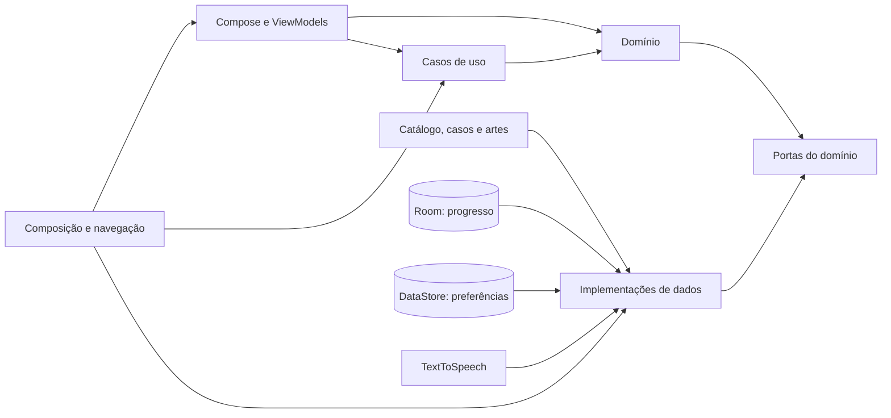

# Arquitetura do Indício

## Objetivo

O Indício é um **motor narrativo offline com um catálogo de casos**, e não um
aplicativo construído em torno de *O Mistério da Taça Desaparecida*. O primeiro
caso valida o motor; os próximos devem entrar como conteúdo, sem condicionais,
telas ou regras Kotlin específicas para cada história.

Esta arquitetura prioriza:

- inclusão de novos casos por JSON e recursos locais;
- progresso independente por caso;
- domínio testável sem Android;
- funcionamento integralmente offline;
- acessibilidade e narração como capacidades comuns a todos os casos;
- evolução controlada do formato, sem interpretar dados desconhecidos.

## Princípios adotados

O projeto combina quatro práticas complementares:

- **DDD:** o código usa a linguagem da investigação e protege as regras do jogo
  em modelos e serviços de domínio;
- **Clean Architecture:** dependências apontam para dentro; domínio e casos de
  uso não conhecem Android, interface, banco, JSON ou composição;
- **SOLID:** responsabilidades, extensões, contratos, interfaces e dependências
  são desenhados para permitir evolução sem acoplamentos ou efeitos colaterais
  indevidos;
- **Clean Code:** nomes expressam intenção, funções têm uma responsabilidade e
  abstrações só existem quando representam uma regra, uma porta ou uma variação
  real.

Não se criam classes `Manager`, `Helper`, `Utils` nem casos de uso que apenas
repassam uma chamada sem acrescentar política. A arquitetura deve reduzir o
custo de mudança, não aumentar a quantidade de arquivos.

### Regra permanente de SOLID

Nenhuma entrega pode romper intencionalmente os princípios SOLID. Eles são
aplicados de forma concreta neste projeto:

- **Responsabilidade única:** cada classe, função e módulo tem um motivo coeso
  para mudar. Conteúdo, regras narrativas, apresentação, persistência e
  integração com Android permanecem separados.
- **Aberto/fechado:** casos e capacidades novas são acrescentados por dados,
  contratos e implementações extensíveis, sem editar o motor para reconhecer
  enredos ou identificadores específicos.
- **Substituição de Liskov:** toda implementação de uma porta preserva o
  contrato, inclusive semântica de sucesso, ausência e falha. Implementações de
  produção e dublês de teste devem poder ser substituídos sem mudar a regra de
  negócio observável.
- **Segregação de interfaces:** portas são pequenas e coesas; um consumidor não
  recebe operações ou dependências que não utiliza.
- **Inversão de dependência:** políticas de domínio e aplicação dependem de
  abstrações internas. Android, JSON, Room, DataStore e TTS implementam essas
  abstrações e são ligados somente na raiz de composição.

SOLID não significa criar uma interface para cada classe nem adicionar camadas
cerimoniais. Uma abstração precisa representar política, fronteira ou variação
real. Testes arquiteturais protegem as dependências que podem ser verificadas
automaticamente; coesão, substituição e qualidade dos contratos também são
critérios obrigatórios da revisão de código. Se uma solução parecer exigir a
quebra de um princípio, ela não deve ser implementada: registre a necessidade e
redesenhe a solução até preservar os cinco princípios.

## Contexto delimitado e linguagem ubíqua

O primeiro contexto delimitado é **Investigação narrativa**. Dentro dele, estes
termos têm significado estável no produto, na documentação, no JSON e no código:

| Termo | Significado |
|---|---|
| Caso | Investigação completa e publicável, com seu grafo narrativo. |
| Cena | Situação apresentada ao jogador em um ponto do grafo. |
| Escolha | Decisão identificada que leva a outra cena. |
| Pista | Descoberta persistente e sem duplicação dentro de um caso. |
| Desfecho | Conclusão positiva alcançada por um caminho válido. |
| Sessão de investigação | Estado de uma tentativa em andamento ou concluída. |
| Progresso salvo | Representação persistida necessária para reconstruir a sessão. |
| Catálogo | Modelo de leitura que lista os casos disponíveis; não é o caso em si. |
| Dica do Anônimo | Recomendação opcional do caminho mais curto até conteúdo ainda não descoberto. |

Há dois agregados principais:

- `Caso` é a raiz do conteúdo e protege cenas, escolhas, pistas e desfechos;
- `SessaoInvestigacao` é a raiz do percurso do jogador e protege cena atual,
  escolhas realizadas, pistas descobertas e conclusão.

Uma sessão referencia um caso pelo identificador estável, mas não possui o
conteúdo dele. `MecanismoNarrativo` é o serviço de domínio que aplica uma
escolha e reconstrói uma sessão sem depender de persistência ou interface.

## Visão geral



A regra de dependência é simples: composição conhece todas as peças para
ligá-las; interface conhece casos de uso e contratos internos; dados implementam
portas declaradas pelo domínio. Domínio e aplicação nunca dependem das camadas
externas. A interface não conhece `data/`, `di/` nem `navegacao/`.

## Camadas e responsabilidades

| Área | Local | Responsabilidade |
|---|---|---|
| Composição | `di/` e `IndicioApplication` | Construir e ligar dependências de produção. |
| Navegação | `navegacao/` | Transportar somente identificadores e decidir destinos. |
| Interface | `ui/` | Renderizar estado e encaminhar ações do jogador. |
| Aplicação | `application/` | Orquestrar casos de uso que combinam portas e políticas. |
| Domínio | `domain/` | Agregados, valores, portas, validação e transições narrativas. |
| Dados | `data/` | Traduzir DTOs, ler JSON, persistir dados e adaptar TTS. |
| Conteúdo | `assets/casos/` e `res/drawable/` | Declarar catálogo, histórias e artes empacotadas. |

O projeto permanece com um único módulo Android, `:app`. Separar módulos agora
adicionaria custo sem isolar um produto independente. A divisão por pacotes e
contratos já permite extrair módulos futuramente se o catálogo, a equipe ou o
tempo de compilação justificarem.

### Regra de dependência por pacote

```text
domain       → Kotlin e coroutines
application  → domain
ui           → application + domain + Android/Compose
data         → domain + tecnologias externas
di/navegacao → application + domain + data + ui
```

Essas fronteiras são protegidas por `DependenciasArquiteturaisTest`. Uma
exceção precisa ser discutida como decisão arquitetural; não se contorna o
teste com import indireto ou classe-ponte vazia.

## Domínio puro e camada anticorrupção

Os modelos do domínio não possuem `@Serializable`, nomes de arquivos, versão de
esquema nem anotações de banco. Esses detalhes pertencem ao formato externo.

Os DTOs de `data/caso/dto/` representam o JSON literalmente. O
`MapeadorConteudo` funciona como camada anticorrupção: converte DTOs em objetos
do domínio antes da validação e impede que mudanças do arquivo se espalhem para
as regras do jogo. O caminho `arquivo` do catálogo e `versaoEsquema`, por
exemplo, são detalhes do adaptador JSON, não conceitos do agregado `Caso`.

## O caso como unidade de conteúdo

O catálogo é o único índice conhecido pelo aplicativo:

```text
app/src/main/assets/casos/
├── catalogo.json
├── taca-desaparecida.json
├── silencio-galeria-nove.json
├── sumico-da-mumia.json
├── ultimo-quadro-estrela-papel.json
├── cidade-sem-meio-dia.json
├── cartas-casa-magnolias.json
├── farol-duas-mares.json
├── ultima-transmissao-radio-aurora.json
├── jardim-fora-de-epoca.json
├── enigma-vagao-boreal.json
├── roubo-rosa-boreal.json
└── <novo-caso>.json
```

Cada entrada informa `id`, título, sinopse, capa acessível, categoria,
disponibilidade e o caminho do arquivo. Cada arquivo de caso contém seu próprio grafo de cenas. O
motor segue `cenaInicial` e `escolhas[].proximaCena`; ele nunca conhece nomes de
cenas ou soluções específicas.

Um caso novo no esquema atual exige apenas:

1. `casos/<id>.json` válido;
2. uma entrada única em `catalogo.json`;
3. uma capa no catálogo e uma arte local para cada cena;
4. revisão editorial, jurídica e de acessibilidade;
5. testes de conteúdo aprovados.

Se for necessário alterar Kotlin para contar a história, há uma capacidade
genérica faltando no esquema ou uma regra de caso vazou para o motor.
Dados específicos de um caso só podem aparecer no código de produção dentro de
previews de interface; testes podem usar histórias exemplificativas como
fixtures. Nenhum desses exemplos participa do fluxo executado pelo aplicativo.

## Identificadores são contratos

- `caso.id` identifica catálogo, rota e registro no banco. Depois de publicado,
  não deve ser renomeado nem reutilizado para outra história.
- `cena.id` é o endereço de um nó do grafo.
- `escolha.id` é persistido na sequência que reconstrói a sessão. Alterá-lo
  depois da publicação pode invalidar o progresso existente.
- `pista.id` elimina duplicatas entre caminhos diferentes e precisa manter o
  mesmo significado dentro do caso.
- nomes de drawable vivem num namespace global do Android. Casos novos devem
  usar `cena_<caso>_<cena>`, com hífens convertidos em sublinhados, para evitar
  colisões. O primeiro caso mantém os nomes antigos por compatibilidade nesta
  etapa.

Textos podem receber correções sem invalidar uma sessão. Mudanças estruturais
em ids devem ser tratadas como migração de conteúdo e testadas com progresso
salvo de versões anteriores.

## Fluxos principais

### Catálogo e abertura

1. `CatalogoViewModel` solicita `RepositorioCasos.catalogo()`.
2. O ViewModel observa `RepositorioProgresso.progressos()` e `historico()`;
   `ProjetarCasosDoCatalogo` consolida os três modelos em estado de leitura,
   último acesso e ações permitidas, sem regras de persistência na interface.
3. Progresso atual e conclusão são conceitos independentes: um caso pode
   continuar marcado como resolvido enquanto uma nova investigação está em
   andamento. Reiniciar apaga somente o progresso atual.
4. `RepositorioCasosJson` desserializa DTOs, valida o contrato externo e os
   converte para o domínio.
5. A rota da história transporta apenas `casoId` e a intenção de retomar ou
   iniciar do começo.
6. `HistoriaViewModel` solicita o caso pelo contrato do domínio.
7. O repositório resolve o arquivo declarado pelo catálogo, desserializa e
   valida o grafo antes de entregá-lo.

### Escolha e salvamento

1. A tela envia o `escolhaId` ao ViewModel.
2. `MecanismoNarrativo` encontra a escolha, avança a sessão e acumula pistas.
3. O ViewModel publica um novo estado imutável.
4. `RepositorioProgresso` salva a sequência de escolhas sob o `casoId`.
5. Ao alcançar um final, a conclusão entra no histórico sem apagar conquistas
   anteriores.

### Retomada

O banco guarda um registro de progresso para cada caso. A sessão completa é
reconstruída reproduzindo as escolhas sobre o JSON atual; cena e pistas não são
a fonte da verdade. Progresso incompatível não derruba o aplicativo: o caso
recomeça de forma controlada.

O botão “Continuar” usa o progresso não concluído atualizado mais recentemente,
mas o modelo permite manter vários casos iniciados ao mesmo tempo.

Para casos do esquema `2`, `CarregarInvestigacao` combina as portas de caso e
progresso e devolve a sessão reconstruída. `ProjetorInvestigacao` transforma
essa sessão em Retomada, Etapas e Caderno sem entregar à interface textos de
etapas futuras ou registros ainda ocultos. A projeção é somente leitura: rever
uma conversa não executa escolha nem cria caminho paralelo no grafo.

### Momento de descoberta

`MecanismoNarrativo` devolve as pistas que entraram na sessão após cada
escolha. `HistoriaViewModel` as publica como `EventoHistoria`, separado do
estado durável da cena, e `DestinoHistoria` mantém uma fila visual para que duas
descobertas simultâneas não se sobreponham. A frase `relevancia` pertence ao
conteúdo da pista; a interface apenas a apresenta.

A contagem de pistas ainda não lidas é estado efêmero do coordenador de
navegação, não do domínio nem do progresso investigativo. Isso permite limpar o
indicador ao abrir o Caderno pela História, Retomada ou Pausa sem transformar
“leitura” em regra narrativa ou criar uma nova tabela local.

`DecidirExibicaoDaRetomada` é a política temporal da aplicação. O intervalo
atual é de 30 minutos desde `atualizadoEm`: abaixo disso o jogador volta direto
à história; a partir disso recebe etapa, resumo, até três lembranças e objetivo.
O relógio e o limite são substituíveis em teste e não pertencem ao conteúdo do
caso.

`CicloDeDescanso` é outra política temporal da aplicação. Ele acumula somente o
uso do aplicativo em primeiro plano, mostra um lembrete visual não bloqueante
aos 20 minutos e, aos 30 minutos, inicia um descanso de três minutos. O relógio
monotônico do Android entra pelo `DescansoViewModel`;
assim a política continua independente da plataforma e pode ser validada com
tempo controlado. Depois de iniciado, o descanso continua correndo em segundo
plano e a interface interrompe a narração, bloqueia a investigação e retorna
automaticamente ao mesmo ponto ao fim da contagem.

## Formato e evolução

Os esquemas suportados são as versões `1` e `2`. A leitura é estrita: campo
desconhecido, referência inválida ou versão diferente produz erro legível. Isso
impede que um erro editorial seja silenciosamente ignorado.

O contrato para casos longos foi aprovado como
[esquema narrativo `2`](esquema-narrativo-v2.md). Ele acrescenta etapas,
objetivos, personagens, locais, conversas, lembranças e `versaoConteudo` sem
alterar incrementalmente o formato `1`. A #013 implementou leitura simultânea,
validação, reconstrução e persistência dos dois formatos. O catálogo de
produção contém onze casos longos no esquema `2`. As inclusões mais recentes
confirmaram que casos novos entram apenas por JSON e artes locais, sem
condicionais de enredo no motor, na navegação ou na interface.

O processo de evolução de qualquer versão continua sendo:

1. definir o contrato completo da nova versão e validá-lo contra pelo menos
   dois formatos de caso;
2. atualizar modelos e validador;
3. decidir compatibilidade ou migração;
4. atualizar mecanismo, apresentação e persistência quando necessário;
5. atualizar o guia de autoria, fixtures e testes;
6. só então publicar conteúdo no formato novo.

Não se acrescentam campos gradualmente ao JSON de produção enquanto o código os
ignora. Para o formato `2`, a sequência de escolhas continua sendo a fonte da
verdade: etapa, objetivo e conteúdo revelado são projeções reconstruídas; o
banco guarda versões, escolhas e índices mínimos para retomada.

## Persistência

Room guarda progresso e histórico porque esses dados são relacionais e precisam
de consulta por caso e por recência. Room também guarda as dicas reveladas, com
caso, cena, escolha e instante de uso, para aplicar atomicamente a cota semanal por caso e não
cobrar novamente ao rever a mesma cena. DataStore guarda somente preferências
globais de leitura e movimento. A aparência segue o modo claro ou escuro do
sistema e não é persistida separadamente pelo aplicativo.

O banco não armazena o texto da história. O JSON empacotado é a fonte da verdade
do conteúdo; o banco armazena referências estáveis e escolhas do jogador. Isso
evita duplicação e permite corrigir redação sem migrar o banco.

## Casos de uso, apresentação e testabilidade

Um caso de uso vive em `application/` quando coordena mais de uma porta ou
expressa uma política de aplicação. `ObterCasoParaContinuar`, por exemplo,
combina catálogo e progresso para decidir se existe uma sessão retomável.

ViewModels são adaptadores de apresentação: convertem resultados do domínio em
estado observável e coordenam detalhes de ciclo de vida. Regras narrativas não
devem nascer neles. Operações simples de uma única porta podem ser chamadas
diretamente pelo adaptador; não se cria um caso de uso de uma linha apenas para
completar um desenho de camadas.

`SugerirEscolha` percorre o grafo sem conhecer enredos específicos e compara a
distância de cada escolha até uma pista, anotação, conversa ou lembrança ainda
oculta. `GerenciarDicas` aplica a cota independente de três novas dicas por caso
na semana ISO, de segunda a domingo. A gravação condicional é transacional no adaptador Room,
impedindo que pedidos concorrentes ultrapassem o limite. Uma dica já revelada
continua disponível em visitas futuras e não volta a consumir a cota.

`ContainerAplicacao` é a raiz de composição manual. ViewModels recebem
interfaces ou casos de uso, nunca o próprio container nem classes de `data/`.
Somente `navegacao/AppIndicio.kt` desmonta o container e entrega dependências às
telas. Testes substituem repositórios, fontes de casos, relógio e narrador por
implementações em memória.

Não há localizador global de serviços. Uma dependência nova deve aparecer no
construtor de quem a usa e, se for compartilhada, no container.

## Barreiras de qualidade

- `ValidadorCaso`: estrutura, referências, finais e alcançabilidade.
- `RepositorioCasosJsonTest`: desserialização estrita, catálogo e vários casos.
- `ConteudoPublicadoTest`: regras editoriais aplicáveis a todo caso disponível.
- `ArteDasCartasTest`: toda cena publicada possui arte e não há arte órfã.
- testes do motor: transições e reconstrução sem Android.
- testes de ViewModel: estados, eventos e falhas recuperáveis.
- testes arquiteturais: direção dos imports entre domínio, aplicação, dados e
  interface.
- testes instrumentados: navegação, persistência real e acessibilidade Compose.

Uma regra genérica deve ser protegida no domínio ou no repositório. Uma regra
editorial sobre o conteúdo empacotado pertence aos testes de publicação.

## Limites deliberados

- Casos são empacotados no APK; adicionar conteúdo requer nova versão do app.
- Não há conta, rede, sincronização ou catálogo remoto.
- Categorias formam um vocabulário controlado. Acrescentar uma categoria é uma
  mudança de produto e de código; acrescentar um caso a uma categoria existente
  não é.
- Os esquemas `1` e `2` exigem exatamente duas escolhas distintas em cada cena
  comum. A quantidade reduz a carga de decisão sem limitar a convergência ou a
  duração dos caminhos narrativos.
- O esquema `1` continua executando o piloto curto, mas Retomada, Etapas,
  Pessoas, Locais e Conversas só existem no esquema `2`.

Se no futuro houver casos baixáveis, uma nova implementação de
`RepositorioCasos` poderá combinar conteúdo empacotado e conteúdo instalado. O
motor e os ViewModels não devem precisar saber de onde o caso veio.
